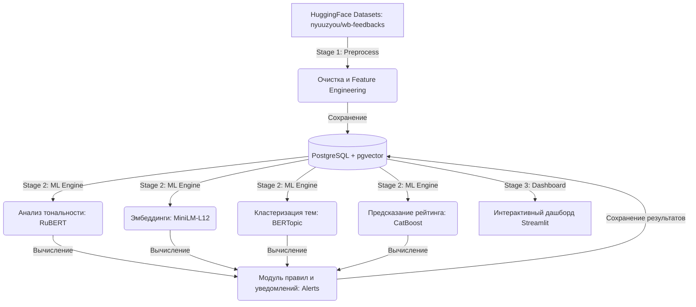

# Wildberries Review NLP Analytics

[](https://www.python.org/)
[](https://www.postgresql.org/)
[](https://github.com/pgvector/pgvector)
[](https://streamlit.io/)
[](https://pytorch.org/)
[](https://huggingface.co/models)
[](https://catboost.ai/)
[](https://www.docker.com/)

**Wildberries Review NLP Analytics** — это комплексная аналитическая платформа и автоматизированный трехэтапный NLP-пайплайн для глубокого анализа отзывов покупателей маркетплейса Wildberries. 

Система извлекает текстовые данные, проводит многоэтапную очистку, векторизует тексты с помощью современных моделей трансформеров, осуществляет тематическое моделирование с помощью BERTopic, прогнозирует «честный» рейтинг на основе мета-признаков через CatBoost, выявляет аномалии и рассчитывает потенциальные финансовые потери бизнеса от накруток или скрытого негатива. Результаты визуализируются в многостраничном интерактивном дашборде на Streamlit.

---

## 🏗 Архитектура системы

Система построена в виде классического трехэтапного пайплайна (без усложнения очередями задач, с возможностью ручного последовательного запуска по мере обновления данных):



### 📂 Структура репозитория

```text
├── loaders/
│   └── hf_loader.py          # Загрузка датасета из HuggingFace в pandas DataFrame
├── preprocess/
│   ├── cleaner.py            # Очистка, нормализация текстов, фильтрация по длине
│   ├── features.py           # Feature engineering (длина отзыва, наличие ответа продавца)
│   └── pipeline.py           # Оркестрация первого этапа: очистка + признаки -> сохранение в БД
├── ml/
│   ├── sentiment.py          # Анализ тональности (seara/rubert-tiny2-russian-sentiment)
│   ├── embeddings.py         # Вычисление плотных векторных представлений текстов (384-dim)
│   ├── clustering.py         # Тематическое моделирование BERTopic (UMAP + HDBSCAN + TF-IDF)
│   └── rating_predictor.py   # Регрессионная модель прогнозирования рейтинга CatBoost
├── db/
│   ├── models.py             # Определение схем таблиц базы данных (SQLAlchemy)
│   └── migrations/           # Миграции базы данных (Alembic)
├── alerts/
│   └── rules.py              # Пороговые правила обнаружения аномалий и несоответствий в БД
├── simulation/
│   └── business_effect.py    # Математическая симуляция упущенной выручки из-за просадки конверсии
├── dashboard/
│   ├── app.py                # Главная страница Streamlit-дашборда (Обзор)
│   ├── utils.py              # Вспомогательные методы работы с БД для интерфейса
│   └── pages/                # Дополнительные разделы аналитики
│       ├── 1_Sentiment.py    # Страница детального анализа тональности по товарам
│       ├── 2_Topics.py       # Страница тематического моделирования (BERTopic)
│       ├── 3_Rating.py       # Анализ расхождений реальных и предсказанных оценок
│       ├── 4_Alerts.py       # Дашборд уведомлений и обнаруженных аномалий
│       └── 5_Simulation.py   # Интерактивный симулятор бизнес-эффектов
├── models/                   # Локальное хранилище весов и обученных артефактов моделей
├── config.py                 # Управление конфигурацией через pydantic-settings и .env
├── preprocess.py             # Главный скрипт запуска Этапа 1
├── main.py                   # Главный скрипт запуска Этапа 2
├── docker-compose.yml        # Контейнеризация СУБД PostgreSQL с поддержкой pgvector
├── alembic.ini               # Конфигурация миграций Alembic
└── requirements.txt          # Зависимости Python-окружения
```

---

## 🛠 Технологический стек

* **СУБД**: PostgreSQL 15 с расширением `pgvector` для высокопроизводительного хранения и поиска семантических векторов.
* **Текстовые эмбеддинги**: `sentence-transformers/paraphrase-multilingual-MiniLM-L12-v2` (размерность 384 признака, оптимизирована для мультиязычных задач семантического сходства).
* **Анализ тональности (Sentiment)**: `seara/rubert-tiny2-russian-sentiment` (высокоэффективный RuBERT-tiny2 для классификации отзывов на три класса: *positive*, *neutral*, *negative*).
* **Тематическое моделирование (Topic Modeling)**: фреймворк `BERTopic` на базе связки алгоритмов **UMAP** (снижение размерности векторов) + **HDBSCAN** (плотностная кластеризация) + **c-TF-IDF** (выделение ключевых слов темы). Темы строятся независимо для позитивных и негативных отзывов.
* **Предиктор оценок (Rating Predictor)**: Градиентный бустинг `CatBoost` (регрессия), обучаемый на поведенческих и текстовых метриках (длина текста, количество слов, наличие/длина ответа продавца, тональность) для восстановления «ожидаемой» оценки товара покупателем.
* **Интерфейс**: `Streamlit` с интерактивной визуализацией графиков на `Plotly`.

---

## 🗄 Схема базы данных

Ниже приведено описание ключевых сущностей, хранящихся в PostgreSQL:

```text
1. products         — Уникальные товары на маркетплейсе (id, marketplace, external_id).
2. reviews          — Исходные отзывы (id, product_id, external_id, text, text_clean, rating, 
                      color, answer, has_answer, review_length).
3. review_ml        — ML-метрики отзывов (review_id, sentiment_label, sentiment_score, 
                      topic_id, fake_score, predicted_rating, embedding).
                      * Столбец embedding хранит вектор (vector(384)) для семантического поиска.
4. topics           — Сгенерированные кластеры тем по товарам (id, product_id, polarity, keywords, review_count).
5. alerts           — Сработавшие аномальные уведомления (id, product_id, rule_name, severity, details, created_at).
```

---

## 🚀 Инструкция по быстрой установке и запуску

### 1. Подготовка окружения и установка зависимостей

Убедитесь, что на вашей машине установлены **Python 3.10+**, **Docker** и **Docker Compose**.

Склонируйте репозиторий и создайте виртуальное окружение:

```bash
git clone https://github.com/nikzhilin/Wildberries-Review-NLP-Analyze.git
cd Wildberries-Review-NLP-Analyze

python3 -m venv .venv
source .venv/bin/activate
pip install -r requirements.txt
```

### 2. Конфигурация параметров (`.env`)

Создайте файл `.env` на основе примера:

```bash
cp .env.example .env
```

Отредактируйте параметры при необходимости. Стандартные переменные среды:

| Переменная | Описание | Значение по умолчанию |
|---|---|---|
| `DATABASE_URL` | Строка подключения к PostgreSQL | `postgresql://wb:wb@localhost:5432/wb_reviews` |
| `HF_DATASET` | Идентификатор датасета на Hugging Face | `nyuuzyou/wb-feedbacks` |
| `MAX_ROWS` | Лимит считываемых отзывов из датасета | `400000` |
| `MARKETPLACE` | Метка маркетплейса в таблице продуктов | `wildberries` |
| `BATCH_SIZE` | Размер пакета для пакетной вставки в БД | `5000` |
| `SENTIMENT_BATCH_SIZE` | Размер пакета для инференса тональности | `64` |
| `EMBEDDING_BATCH_SIZE` | Размер пакета для генерации эмбеддингов | `128` |
| `SENTIMENT_MODEL` | Hugging Face ID модели тональности | `seara/rubert-tiny2-russian-sentiment` |
| `EMBEDDING_MODEL` | Hugging Face ID модели эмбеддингов | `sentence-transformers/paraphrase-multilingual-MiniLM-L12-v2` |
| `MIN_CLUSTER_REVIEWS` | Минимальное число отзывов у товара для BERTopic | `50` |

### 3. Запуск инфраструктуры базы данных

Запустите контейнер PostgreSQL 15 с расширением `pgvector`:

```bash
docker compose up -d
```

Примените миграции Alembic для автоматического создания структуры таблиц и индексов в БД:

```bash
alembic upgrade head
```

---

## 🏃‍♂️ Выполнение этапов обработки данных (Пайплайн)

Запуск пайплайна разделен на логические шаги. Вы можете перезапускать любой этап отдельно — логика идемпотентна благодаря дедупликации данных.

### Этап 1: Загрузка и предобработка данных

Загружает датасет `nyuuzyou/wb-feedbacks` с HuggingFace, выполняет очистку текстов (удаление HTML, URL, лишних пробелов, перевод в нижний регистр), фильтрует аномально короткие/длинные тексты, рассчитывает базовые поведенческие метрики и сохраняет данные в таблицы `products` и `reviews`.

```bash
python preprocess.py
```

*Пример лога консоли при успешном выполнении:*
```text
MAX_ROWS=400,000  BATCH_SIZE=5,000
Loading HuggingFace dataset 'nyuuzyou/wb-feedbacks'...
Dataset loaded: 312,450 rows.
Running clean and feature engineering pipelines...
Dropping reviews shorter than 3 tokens or truncating over 512 tokens.
Deduplicating rows based on (marketplace, external_id)...
Writing to DB (batch_size=5,000)...
[100%] Processed and saved 308,124 reviews for 1,412 products. Done!
```

### Этап 2: Вычисление ML-метрик и детекция аномалий

Скрипт считывает сохраненные отзывы из БД, запускает батч-инференс моделей на CPU/GPU, рассчитывает тональность и эмбеддинги отзывов, обучает BERTopic для поиска ключевых микро-тем по товарам, строит регрессионный CatBoost-предиктор оценок и проверяет пороговые правила для генерации бизнес-оповещений.

```bash
python main.py
```

*Пример лога консоли при успешном выполнении:*
```text
Connecting to database...
Found 308,124 reviews to process.
1/5. Running sentiment analysis (batch_size=64)... [OK]
2/5. Computing paraphrase-multilingual embeddings (batch_size=128)... [OK]
3/5. Executing BERTopic clustering per product (min_reviews=50)... [OK]
4/5. Training CatBoost rating predictor and predicting expected stars... [OK]
5/5. Evaluating threshold-based alert rules...
     - rule_high_negative_share          → 42 alerts
     - rule_rating_sentiment_mismatch    → 18 alerts
     - rule_predicted_rating_gap         → 24 alerts
     - rule_low_overall_rating           → 8 alerts
Saving ML features to review_ml, topics, and alerts... Done!
```

### Этап 3: Запуск аналитического дашборда

После наполнения базы данных запустите визуальный Streamlit-интерфейс:

```bash
streamlit run dashboard/app.py
```

Дашборд откроется в вашем браузере по адресу: `http://localhost:8501`.

---

## 🧠 Описание ML алгоритмов и правил выявления аномалий

### 1. Тематическое моделирование (BERTopic)
Для каждого товара с количеством отзывов $\ge 50$ система запускает локальный BERTopic-анализ раздельно для позитивных и негативных отзывов. 
* Векторы отзывов проецируются в пространство меньшей размерности при помощи **UMAP**.
* Документы группируются алгоритмом **HDBSCAN**.
* Применяется модифицированная формула **c-TF-IDF** для выделения топ-слов/словосочетаний, наиболее репрезентативно описывающих каждый кластер отзывов (например: *«плохая упаковка, разбитая крышка, пролился»*).

### 2. Предиктор «ожидаемой» оценки
Обучается CatBoost-регрессор. Его цель — предсказать оценку (от 1 до 5 звезд) на основе признаков отзыва, не зависящих от субъективного настроения в звездах:
* Длина отзыва в символах и словах.
* Быстрота и наличие ответа продавца (`has_answer`, `answer_length`).
* Спектр тональности (Confidence score положительного, нейтрального и негативного классов).

Если фактическая оценка покупателя существенно выше прогнозируемой моделью оценки (Rating Gap $> 0.5$ или $> 1.0$), это может свидетельствовать о накрутке рейтинга (купленный отзыв с шаблонным текстом при 5 звездах) либо о феномене «вежливого покупателя» (жалуется в тексте, но ставит высокий балл).

### 3. Модуль правил и уведомлений (Alerts Engine)
На основе ML-выходов работают 4 критических детектора:
1. **Высокая доля негатива (`high_negative_share`)**: доля негативных отзывов о товаре превышает 30% (Medium) или 50% (High).
2. **Рассогласование текста и оценки (`rating_sentiment_mismatch`)**: средний рейтинг товара высокий ($\ge 4.0$), однако доля негативных текстов среди всех отзывов превышает 20% (Medium) или 35% (High).
3. **Разрыв прогнозируемой оценки (`predicted_rating_gap`)**: фактический средний рейтинг товара превышает предсказанный бустингом уровень более чем на $0.5$★ (Medium) или на $1.0$★ (High).
4. **Критически низкий рейтинг (`low_overall_rating`)**: средний рейтинг товара опустился ниже 3.0 (Medium) или 2.0 (High).

---

## 📊 Инструкция пользователя: Обзор страниц дашборда

### 🌐 Главная страница — Общий обзор пайплайна (`app.py`)
Предназначена для верхнеуровневого мониторинга состояния всего пула товаров и оценки общей производительности пайплайна.

* **Ключевые метрики (KPI)**: общее количество проанализированных отзывов, уникальных товаров, выделенных тем и сработавших алертов (включая критические с высокой степенью важности).
* **Показатели полноты данных (Pipeline Completeness)**: интерактивные шкалы прогресса, отражающие долю отзывов, прошедших классификацию тональности, векторизацию и оценку бустингом.
* **Глобальная тональность**: круговая диаграмма (Pie Chart) распределения эмоционального окраса среди всех отзывов платформы.
* **Лидеры по активности**: столбчатая диаграмма топ-20 товаров по объему обратной связи.
* **Лента инцидентов**: таблица последних критических аномалий, требующих немедленного вмешательства категорийного менеджера.

---

### 💬 Раздел 1. Анализ тональности (`1_Sentiment.py`)
Позволяет проводить точечную диагностику эмоционального фона конкретного артикула/товара.

* **Инструменты фильтрации**: селектор выбора товара из топ-100 по популярности с отображением количества отзывов.
* **Сводка по продукту**: количественные показатели позитивных, нейтральных и негативных мнений.
* **Распределение тональности**: сравнительная гистограмма классов тональности выбранного товара.
* **Матрица тональности и звездности (Rating × Sentiment Score)**: интерактивная диаграмма рассеяния (Scatter Plot) с регулируемой прозрачностью, показывающая, с какой уверенностью модель размечала тексты на различных уровнях оценок (от 1 до 5 звезд).
* **Глобальная тепловая карта (Rating × Sentiment Heatmap)**: кросс-табличная тепловая карта по всей базе данных для поиска системных паттернов (например, поиск 5-звездочных отзывов с резко негативным содержанием).
* **Списки краш-отзывов**: таблица наиболее уверенно негативных отзывов с детальным текстом для быстрого поиска проблем.

---

### 🗂 Раздел 2. Тематическое моделирование (`2_Topics.py`)
Обеспечивает автоматическое выделение смысловых кластеров в огромных массивах неструктурированного текста с помощью BERTopic.

* **Разделение по полярностям**: вкладки (Tabs) для независимого переключения между «Положительными» и «Отрицательными» темами товара.
* **Смысловая таблица**: список ключевых слов-маркеров темы, ранжированный по количеству отзывов в кластере.
* **Визуализация долей тем**: горизонтальная столбчатая диаграмма, наглядно показывающая долю каждого обсуждения в общем объеме фидбека.
* **Спецификатор отзывов**: интерактивный выпадающий список тем. При выборе конкретной темы внизу динамически формируется таблица реальных отзывов покупателей, отнесенных к этому кластеру. Это позволяет сразу понять контекст жалобы или похвалы (например, оторванная ручка, долгая доставка, приятный запах).

---

### ⭐ Раздел 3. Предиктор оценок (`3_Rating.py`)
Инструмент выявления аномальных перекосов оценочной шкалы с помощью сопоставления субъективной оценки пользователя с объективным прогнозом CatBoost.

* **Интерактивные фильтры**: слайдер ограничения минимального количества отзывов на товар для отсечения статистического шума.
* **Метрики расхождений**: средний размер расхождения (gap) по системе, максимальное зафиксированное отклонение в звездах и количество товаров с завышенным рейтингом.
* **Карта расхождений (Real vs Predicted Rating)**: пузырьковая диаграмма рассеяния (каждая точка — отдельный продукт, размер пузырька зависит от количества отзывов, цвет — от величины расхождения). Пунктирная диагональ обозначает идеальное соответствие. Пузырьки, ушедшие далеко вверх от диагонали, — товары с подозрением на накрутку звезд.
* **Гистограмма распределения сдвига**: график плотности распределения сдвига оценок с вертикальной чертой на отметке `0.0` (норма).

---

### 🚨 Раздел 4. Мониторинг аномалий и предупреждений (`4_Alerts.py`)
Операционная панель для специалистов по контролю качества и комплаенсу.

* **Сводка инцидентов**: счетчики общего числа алертов с группировкой по степени критичности (High, Medium, Low).
* **Аналитика угроз**:
  * Горизонтальный столбчатый график распределения аномалий по типам сработавших правил.
  * Круговая диаграмма соотношения уровней опасности.
* **Глубокая фильтрация**: интерактивные мультиселекторы для фильтрации таблицы инцидентов по конкретным типам правил и критичности.
* **Таблица инцидентов**: структурированная таблица с указанием ID товара, названия правила, его критичности и развернутых деталей в формате JSON-логов (значения реального и предсказанного рейтингов, точная доля негатива в процентах и штуках).

---

### 💰 Раздел 5. Бизнес-симулятор эффектов (`5_Simulation.py`)
Интерактивный финансовый инструмент, переводящий сухие NLP-метрики и аномалии рейтинга на язык денег (упущенной прибыли).

#### 🧮 Математическая модель симуляции:
$$Rating\ Gap = Real\ Average\ Rating - Predicted\ Average\ Rating$$
$$Conversion\ Penalty\% = Rating\ Gap \times Conversion\ Penalty\ per\ Star\ (e.g.,\ 15\%)$$
$$Lost\ Revenue = Monthly\ Sales\ (units) \times Conversion\ Penalty\% \times Avg\ Product\ Price\ (₽)$$

* **Панель бизнес-допущений**: интерактивные поля ввода и слайдеры для калибровки модели под экономику конкретного магазина:
  * Ожидаемые ежемесячные продажи на один товар (в штуках).
  * Средняя цена единицы товара (в рублях).
  * Штраф конверсии на каждую потерянную звезду рейтинга.
  * Минимальный порог отзывов.
* **Финансовые KPI**: общая упущенная выручка по всем товарам в месяц ($₽/\text{мес}$), средний разрыв звезд, количество проблемных товаров.
* **Диаграмма финансовых потерь**: горизонтальная столбчатая диаграмма топ-20 товаров, приносящих наибольшие ежемесячные убытки из-за завышенного или заниженного качества (градиент цвета отражает величину расхождения в звездах).
* **Сводная интерактивная таблица**: детальная выгрузка расчетов с форматированием валюты и процентов по каждому артикулу.

---

## 📜 Лицензия

Лицензия **MIT**. Подробности в файле [LICENSE](LICENSE).

